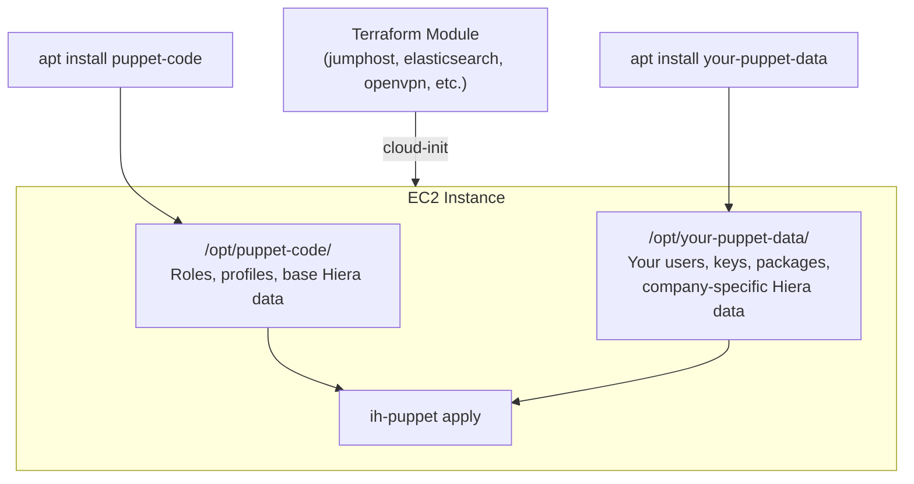

# puppet-code

InfraHouse Puppet roles and profiles for infrastructure management on AWS.
Packaged as a Debian package and deployed via an S3-backed APT repository.

## Architecture

The codebase follows the standard Puppet **role-profile pattern**:

```
modules/
  role/manifests/       # Roles — what a server *is* (e.g. webserver, jumphost)
  profile/manifests/    # Profiles — how a technology is configured (e.g. docker, ntp)

environments/
  production/           # Production environment
  development/          # Development environment (new features land here first)
  sandbox/              # Sandbox environment
```

Each environment contains:

- `manifests/site.pp` — entry point; dynamically loads classes via Hiera
- `hiera.yaml` — hierarchical data lookup configuration
- `data/` — Hiera data files keyed by role name, node certname, or `common.yaml`

### Hiera Hierarchy

```
1. data/%{::puppet_role}.yaml        # Per-role data
2. data/nodes/%{::trusted.certname}.yaml  # Per-node overrides
3. data/common.yaml                  # Common defaults
```

### How Roles Work

A role Hiera file assigns a role class:

```yaml
# environments/production/data/webserver.yaml
classes:
  - role::webserver
```

The role class includes one or more profiles:

```puppet
# modules/role/manifests/webserver.pp
class role::webserver {
  include 'profile::webserver'
}
```

### Base Profile

Every role inherits `profile::base`, which configures NTP, APT repos, standard
packages, InfraHouse toolkit, Puppet apply wrapper, swap, accounts, and sudo.

### Available Roles

| Role | Description |
|------|-------------|
| `base` | Base configuration only |
| `bookstack` | BookStack wiki |
| `ecsnode` | AWS ECS container host |
| `elastic_data` | Elasticsearch data node |
| `elastic_master` | Elasticsearch master node |
| `github_runner` | GitHub Actions self-hosted runner |
| `infrahouse_github_backup` | GitHub backup service |
| `jumphost` | SSH bastion host |
| `mta` | Mail transfer agent |
| `openvpn_server` | OpenVPN server |
| `percona_server` | Percona MySQL server |
| `teleport` | Teleport access proxy |
| `terraformer` | Terraform runner |
| `webserver` | Web server |

### Environment-Specific Overrides

The `development` and `sandbox` environments can override any profile by placing
a modified version in `environments/<env>/modules/profile/manifests/`. These
take precedence over the shared `modules/profile/` during Puppet runs targeting
that environment.

## Getting Started

### Prerequisites

- Ubuntu (Noble 24.04 or later)
- `puppet-agent` package installed
- [`ih-puppet`](https://pypi.org/project/infrahouse-toolkit/) for local testing

### Install the InfraHouse APT Repository

```bash
sudo make install-infrahouse-repo
```

### Install the Package

```bash
sudo apt-get install puppet-code
```

The package installs to `/opt/puppet-code/`.

## Development

### Set Up Git Hooks

```bash
make hooks
```

This installs a pre-commit hook that:
1. Runs `puppet-lint --fail-on-warnings` on all modules
2. Bumps the package version in `debian/changelog`

### Lint

```bash
puppet-lint --fail-on-warnings modules/profile
puppet-lint --fail-on-warnings modules/role
puppet-lint --fail-on-warnings environments/development/modules/profile
puppet-lint --fail-on-warnings environments/sandbox/modules/profile
```

### Test Locally

Apply Puppet code on the current machine (requires `ih-puppet`):

```bash
make test-puppet
```

### Build a Package

```bash
make package
# or target a specific Ubuntu release:
OS_VERSION=noble make package
```

### Run a Docker Shell

```bash
make docker
```

Drops you into an Ubuntu Noble container with the repo mounted at `/puppet-code`.

## CI/CD

| Workflow | Trigger | What it does |
|----------|---------|--------------|
| **CI** (`CI.yml`) | Pull request to `main` | Builds the package on Ubuntu Noble |
| **CD** (`CD.yml`) | Push to `main` / manual | Builds for Noble + Oracular, publishes to S3-backed APT repo via `ih-s3-reprepro` |

Every commit to `main` automatically increments the package version (via the
pre-commit hook) and triggers a new release.

## Using puppet-code in Your Organization

`puppet-code` is designed to be company-agnostic. It provides reusable roles and
profiles that any organization can use as-is. Company-specific configuration
(user accounts, SSH keys, packages, sudo rules, etc.) lives in a separate
**puppet-data** package that you create and maintain.

There are two usage patterns:

### Scenario A: Using puppet-code Directly (No Custom Configuration)

If the defaults in `puppet-code` are sufficient, InfraHouse Terraform modules
work out of the box — no extra Puppet configuration needed.

For example, deploying a jumphost:

```hcl
module "jumphost" {
  source  = "registry.infrahouse.com/infrahouse/jumphost/aws"
  version = "~> 4.5"

  environment     = "production"
  ubuntu_codename = "noble"
  subnet_ids      = module.management.subnet_private_ids
  nlb_subnet_ids  = module.management.subnet_public_ids
  route53_zone_id = aws_route53_zone.example.zone_id
}
```

By default, the Terraform modules install `puppet-code` from the InfraHouse APT
repository and use its built-in Hiera data
(`/opt/puppet-code/environments/{environment}/hiera.yaml`).

### Scenario B: Adding Your Own Puppet Configuration

For company-specific settings, create a separate **puppet-data** repository. This
is a Debian package that installs alongside `puppet-code` and provides:

- A custom `hiera.yaml` that sits higher in the lookup hierarchy
- Hiera data files with your organization's configuration (users, packages, sudo
  rules, etc.)
- Optionally, additional Puppet modules

#### Step 1: Create Your puppet-data Repository

Use [infrahouse-puppet-data](https://github.com/infrahouse/infrahouse-puppet-data)
as a reference. Your repo should look like this:

```
your-puppet-data/
  environments/
    production/
      hiera.yaml          # Your Hiera config
      data/
        common.yaml       # Company-wide defaults (users, packages, sudo rules)
        jumphost.yaml     # Role-specific data
        ...
    development/
      ...
  modules/                # Your own Puppet modules (unique names, not overrides)
    mycompany_monitoring/
      manifests/
        init.pp
    mycompany_backups/
      manifests/
        init.pp
  debian/                 # Debian packaging (so it becomes an APT package)
```

Your `debian/control` should declare a dependency on `puppet-code`:

```
Package: your-puppet-data
Depends: puppet-agent, puppet-code
```

The package installs to `/opt/your-puppet-data/`.

#### Step 2: Configure Hiera Data

Your `environments/production/data/common.yaml` is where company-specific
configuration goes. Use `lookup_options` with `deep` merge so your data
combines with (rather than replaces) data from `puppet-code`:

```yaml
---
# Deep merge lets your values merge with puppet-code's defaults
# instead of replacing them entirely.
lookup_options:
  accounts::user_list:
    merge:
      strategy: deep
  profile::packages:
    merge:
      strategy: deep

# Packages to install on every instance
profile::packages:
  your-puppet-data: latest
  awscli: present
  jq: present

# Sudo rules
sudo::configs:
  'admin':
    'content': '%admin ALL=(ALL) NOPASSWD: ALL'
    'priority': 10

# User accounts and SSH keys
accounts::group_list:
  admin: {}

accounts::user_list:
  alice:
    group: 'admin'
    sshkeys:
      - 'ssh-ed25519 AAAA... alice@example.com'
  bob:
    group: 'admin'
    sshkeys:
      - 'ssh-ed25519 AAAA... bob@example.com'
```

Role-specific Hiera files assign `puppet-code` roles **and** your own modules:

```yaml
# environments/production/data/jumphost.yaml
---
classes:
  - role::jumphost
  - mycompany_monitoring
  - mycompany_backups::daily
```

This is the key pattern: `role::jumphost` comes from `puppet-code`, while
`mycompany_monitoring` and `mycompany_backups::daily` come from your own
`modules/` directory. You can also add role-specific packages, users, or
any other Hiera data here.

#### Step 3: Build and Publish Your Package

Package it as a `.deb` and publish to your own S3-backed APT repository (or any
APT repo). See the `Makefile` and `support/` directory in
[infrahouse-puppet-data](https://github.com/infrahouse/infrahouse-puppet-data)
for a working example.

#### Step 4: Wire It Up in Terraform

When calling InfraHouse Terraform modules, point Puppet at your data package
using three key variables:

| Variable | Purpose | Example |
|----------|---------|---------|
| `puppet_hiera_config_path` | Path to your Hiera config | `/opt/your-puppet-data/environments/${var.environment}/hiera.yaml` |
| `puppet_module_path` | Add your own modules to the module path | `{root_directory}/modules:/opt/your-puppet-data/modules` |
| `packages` | Install your puppet-data package at boot | `["your-puppet-data"]` |

> **A note on `puppet_module_path` and overriding profiles.**
> Puppet searches the module path left to right and uses the **first directory
> that contains a matching module name**. It does not merge manifests from
> multiple directories. This means you cannot override a single profile from
> `puppet-code`'s `profile` module by placing a file with the same module name
> in another directory — Puppet would either use your `profile` module entirely
> (losing all of `puppet-code`'s profiles) or ignore it entirely.
>
> Use `puppet_module_path` to add **new modules with different names** (e.g.,
> `mycompany::some_service`). For company-specific configuration of existing
> roles, use Hiera data — that is the intended customization mechanism.

If your puppet-data package lives in a private APT repository, also configure
`extra_repos` and `extra_files` (for authentication):

```hcl
module "jumphost" {
  source  = "registry.infrahouse.com/infrahouse/jumphost/aws"
  version = "~> 4.5"

  environment     = var.environment
  ubuntu_codename = "noble"
  subnet_ids      = module.management.subnet_private_ids
  nlb_subnet_ids  = module.management.subnet_public_ids
  route53_zone_id = aws_route53_zone.example.zone_id

  # Point Puppet at your Hiera config
  puppet_hiera_config_path = "/opt/your-puppet-data/environments/${var.environment}/hiera.yaml"

  # Add your own modules (new module names only, not overrides)
  puppet_module_path = "{root_directory}/modules:/opt/your-puppet-data/modules"

  # Install your puppet-data package
  packages = ["your-puppet-data"]

  # (If using a private APT repo) Add repo credentials and source
  extra_files = [
    {
      path        = "/etc/apt/auth.conf.d/your-company.conf"
      permissions = "0600"
      content     = <<-EOT
        machine release-noble.your-company.com
        login ${local.http_username}
        password ${local.http_password}
      EOT
    }
  ]
  extra_repos = {
    your-company = {
      source = "deb [signed-by=$KEY_FILE] https://release-noble.your-company.com/ $RELEASE main"
      key    = file("${path.module}/files/DEB-GPG-KEY-your-company-noble")
    }
  }
}
```

This same pattern works with every InfraHouse Terraform module — Elasticsearch,
OpenVPN, ECS nodes, etc. The key variables (`puppet_hiera_config_path`,
`puppet_module_path`, `packages`) are consistent across all modules.

#### Step 5: Pass Custom Facts (Optional)

Some profiles are driven by Puppet custom facts. You can pass them from
Terraform via the `puppet_custom_facts` variable:

```hcl
module "jumphost" {
  # ...
  puppet_custom_facts = {
    postfix = {
      smtp_credentials = module.smtp_credentials.secret_name
    }
  }
}
```

These facts become available in Puppet as `$facts['postfix']['smtp_credentials']`.

### How It All Fits Together



Puppet reads `your-puppet-data`'s `hiera.yaml`, which can reference data
directories from both packages. The roles and profiles come from `puppet-code`;
your organization's configuration comes from `your-puppet-data`.

## License

Apache License 2.0 — see [LICENSE](LICENSE) for details.
